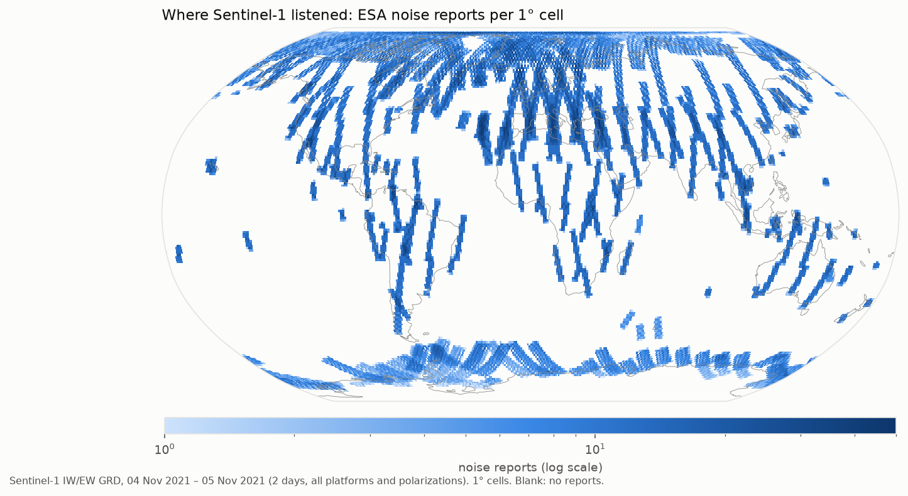
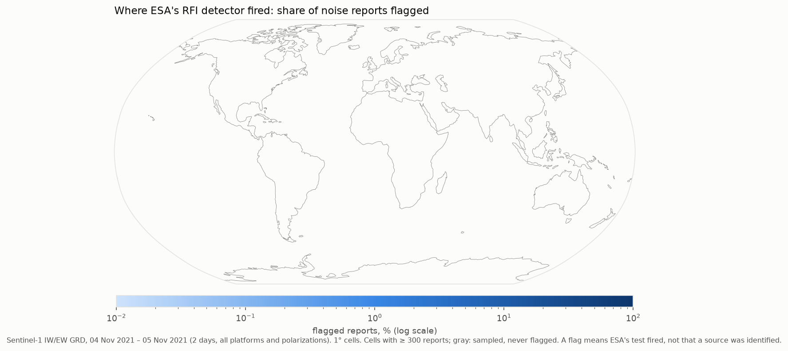
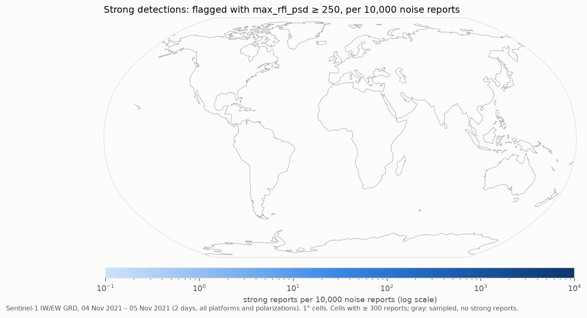
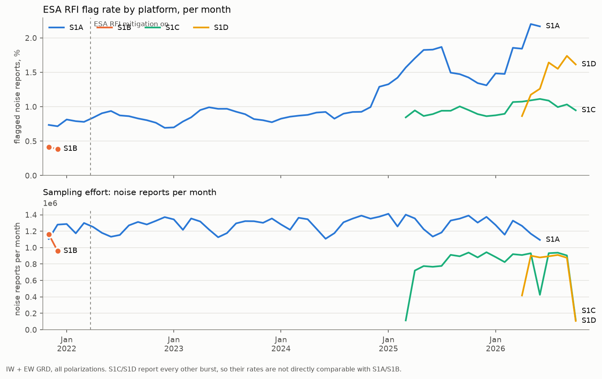

# Sentinel-1 RFI annotation inventory

A global, daily inventory of the radio-frequency-interference (RFI) annotations that ESA's
Sentinel-1 processor has written into every Level-1 product since 4 November 2021 (IPF 3.40).
It covers every IW GRDH and EW GRDM product in the Copernicus Data Space Ecosystem (CDSE). The
data are published as one Parquet file per day and kind; their size is estimated below.

For each noise-sequence report, the inventory records:
- its time and approximate ground position;
- ESA's detection flag and test statistics.

The sampling effort is kept too: reports without a detection are included, so rates can be
computed, not just counts.

## Figures

Redrawn every Monday from the published data (`.github/workflows/figures.yml`, `scripts/figures.py`).
Until the backfill reaches the present, they cover only the days done so far; the date range is
printed on each figure. The tables behind them are in `figures/*.csv`.



**Where Sentinel-1 listened.** Noise reports per 1° cell: the sampling effort, and the denominator
of every rate below. Coverage follows the acquisition plan (dense over land and Europe, sparse over
open ocean). The striping comes from the positions being swath centres.



**Where ESA's detector fired.**
- The share of noise reports flagged per cell, for cells with at least 300 reports.
- Grey cells were sampled but never flagged.
- Persistent high rates mark places with steady in-band emitters, most of them ground radars.
- A flag says that ESA's test fired. It does not say what the source was, and interference that
  the test is not sensitive to is not counted.



**Strong detections.** Flagged reports with ESA's `max_rfi_psd` ≥ 250, per 10,000 noise reports.
That threshold is about the 90th percentile of flagged reports in Nov 2021 and Nov 2023 samples. The
map picks out the most intense sources. The threshold is fixed, not recomputed, so it means the same
thing at every date.



**Change over time.** Monthly flag rate and monthly noise reports per platform.
- Platform changes (S1B's end in Dec 2021, S1C from 2025, S1D from 2026, S1A's end in Jul 2026)
  and ESA's mitigation (from Mar 2022) are the main confounders to keep in mind.
- S1C/S1D report every other burst, so compare their rates with each other rather than with
  S1A/S1B.
- The figure shows global totals. It does not model them, so it does not by itself separate a real
  change in interference from a change in where Sentinel-1 looked.

## What is in the data

ESA's IPF runs an RFI detector on each product. Its output is in `annotation/rfi/*.xml`: per swath
and polarization,
- a report for each noise sequence (at the start of a burst), with a detection flag and test
  statistics;
- a report per burst, with an in-band/out-of-band power ratio and, where ESA's mitigation examined
  the burst, the fraction of lines and bandwidth affected.

This repository fetches only those small XML files (one per polarization, ~30 KB each; never the
imagery) and flattens them into tables.

**`noise_YYYY-MM-DD.parquet`**: one row per noise report per polarization.

| Column | Meaning |
|---|---|
| `swath`, `polarization` | e.g. `IW2`, `VV` |
| `noise_sensing_time` | UTC time of the noise sequence |
| `rfi_detected` | ESA's flag |
| `max_kl_divergence`, `max_fisher_z`, `max_rfi_psd` | ESA's test statistics |
| `latitude`, `longitude` | the swath centre at that time, interpolated from the product footprint (within ~4 km of ESA's geolocation grid for IW, ~6 km for EW). This is where Sentinel-1 was looking, not where the source is: an emitter can be anywhere in the ~80 km-wide swath or reach the antenna from outside it |
| `rfi_mitigation_applied` | the product's mitigation setting (e.g. `TimeFrequency`) |
| `product_*` | product name, id, platform, orbit direction, relative orbit, start/end, processor (IPF) version, timeliness |
| `duplicate` | `True` for a report repeated in the overlap of two consecutive slices of one datatake. **Exclude these before counting.** |

**`bursts_YYYY-MM-DD.parquet`**: one row per burst report per polarization:
- `azimuth_time`;
- `in_out_band_power_ratio`;
- the `td_*` / `fd_*` affected-lines and affected-bandwidth fields, where ESA reports them;
- position, product columns and `duplicate`, as above.

**`cells_YYYY-MM-DD.parquet`**: per 1° cell (the floored report position) × platform × co/cross
polarization, the numbers of noise reports, flagged reports and strong reports (flagged with
`max_rfi_psd` ≥ 250), with duplicates excluded. These are small files for maps and regional
series. The first two days (2021-11-04/05) were published before these files existed; `scripts/figures.py` rebuilds them from the
noise file.

**`data/daily_summary.csv`** (in git): for each day × platform × mode × polarization, the
catalogue products, harvested products, noise reports, flagged reports and products with
mitigation applied. This is the effort layer for rate analyses.

## Access

The day files are assets of monthly releases (`data-YYYY-MM`), e.g. with DuckDB:

```sql
SELECT product_platform, count(*) AS reports, sum(rfi_detected::int) AS flagged
FROM 'https://github.com/egagli/s1-rfi-inventory/releases/download/data-2024-01/noise_2024-01-10.parquet'
WHERE NOT duplicate
GROUP BY 1;
```

Or download a month with `gh release download data-2024-01 --repo egagli/s1-rfi-inventory`.

## How it is built

- `scripts/run_days.py` works through the days listed in a manifest (released as `manifest`):
  - catalogue search for the day;
  - when a slice was processed more than once, only the newest processing is kept;
  - it downloads each product's RFI annotation, then consolidates and writes the day files.
- Recent days are re-checked, because products reach the catalogue with a delay.
- `.github/workflows/inventory.yml` runs it every 6 hours for up to ~5 hours, then publishes.
- `.github/workflows/figures.yml` redraws the figures weekly (`pip install -r requirements-figures.txt`
  for local use).
- Requests are throttled (≤ 3 parallel downloads, ≥ 0.1 s apart, retries with back-off).
- It needs a free CDSE account, supplied as the repository secrets `CDSE_USERNAME` and
  `CDSE_PASSWORD`. Nothing else is used.

Local use:

```bash
pip install -r requirements.txt
export CDSE_USERNAME=... CDSE_PASSWORD=...
python scripts/run_days.py --manifest state/manifest.csv --out out --max-days 1
python scripts/harvest.py --help   # one area and period instead
python -m pytest -q                # offline tests
```

**Cost, measured:**

| Day | Products | Time | Output |
|---|---|---|---|
| 2024-01-10 (S1A only) | ~600 | ~2.5 min, ~1,200 requests | ~3 MB |
| 2021-11-04/05 (S1A + S1B) | ~1,100 | ~5 min | ~5 MB |

The archive since Nov 2021 is ~1,800 days: very roughly 100–150 h of harvesting in total and a few
GB of files.

## Things to know before using the flags

- **They are ESA's detections, not a complete record of interference.** The detector sees only the
  noise sequences at the start of each burst. Interference that arrives later in a burst, or whose
  statistics its tests are not sensitive to, can go unflagged. A flag says that ESA's test fired,
  not what the source was or whether the image was affected.
- **The sampling is uneven.** Coverage follows the Sentinel-1 observation scenario: dense over
  Europe and land, sparse over open ocean, at fixed local times (~06 and ~18 h). Normalise counts
  by the noise reports (effort), not by area or time alone.
- **The platforms differ.**
  - S1B stopped in Dec 2021; S1C data start in 2025 and S1D in 2026; S1A ended in Jul 2026.
  - S1A reports one noise sequence at the start of every burst (every 2.76 s per swath).
  - S1C and S1D report every other burst (5.52 s), at different times within the burst cycle.
  - Keep platforms as separate strata.
- **Processor versions change.** Detection thresholds may differ between IPF versions, so the
  processor version is kept in `product_processor_version`. The CDSE catalogue does not give it
  for older products (e.g. most of 2021), so it is missing there.
- **Positions are approximate** (swath centre, ±~40 km). They are good enough for regional rates,
  not for locating a source.

## Attribution and licence

- **Code:** MIT (see `LICENSE`).
- **Data** (the release files and `data/daily_summary.csv`): [CC BY 4.0](https://creativecommons.org/licenses/by/4.0/).
  Please cite this repository.
- **Source data:** the tables are derived from ESA's Sentinel-1 annotation files. They contain
  modified Copernicus Sentinel data [year of the data], processed by ESA, obtained from the Copernicus
  Data Space Ecosystem (free, full and open under the Copernicus data policy).

The test fixtures are real Sentinel-1 annotation files from
[odhondt/eo_tools](https://github.com/odhondt/eo_tools) (MIT) and
[bopen/xarray-sentinel](https://github.com/bopen/xarray-sentinel) (Apache-2.0); see
`tests/fixtures/README.md`.
